 

  <a href="https://api.github-star-counter.workers.dev/user/CEONEINDEDALUS">
    
  
  

 

<!-- ═══════════════ ABOUT ME ═══════════════ -->

  

 

<!-- Custom animated side-art. Prefer a real GIF? Swap the src below for any
     tenor/media GIF URL you like (see SETUP.md → "Swap the side art"). -->

**`$ whoami`** → I'm **Ceonein Dedalus**, the human behind `Team Dedalus`. I build **open-source tools** for `privacy`, `security` and `automation`, and I run on one rule: **if it doesn't respec[...]

I write **Python** and **Rust**, run **local LLMs** on my own hardware, and ship **offline-first software**: AI assistants that never leave your machine (`veronica`), RAG pipelines that query priv[...]

I treat privacy as **architecture, not a feature** — the cloud is just someone else's computer, so I de-cloud things. Currently digging into `local-first sync`, `e2e encryption` and automating a[...]

 

 

 

 

 

<!-- ═══════════════ CONNECT ═══════════════ -->

  
 
 

  <!-- ▼ ACTION REQUIRED: put your real email in the mailto link below ▼ -->
  
  

 

> [!CAUTION]
>
> **Trust is a vulnerability.** Verify everything. Encrypt everything. Assume breach.
>
> What you see here is compiled from `coffee`, `curiosity` and `chmod +x`.
>
 

<!-- ═══════════════ CONTRIBUTIONS ═══════════════ -->

  
 
 

[![commit history :: last 365 days](https://github-readme-activity-graph.vercel.app/graph?username=CEONEINDEDALUS&bg_color=0D0D0D&color=EAEAEA&line=FF1001&point=FFFFFF&area=true&area_color=FF1001&[...]

 

<!-- ═══════════════ STACK + PROJECTS ═══════════════ -->
<table align="center">
  <tr>
    <!-- Tech stack -->
    <td valign="top" width="46%">
      

       
      

         
         
        
      

    </td>
    <!-- Projects + streak -->
    <td valign="top" width="54%">
      

       
      <a href="https://github.com/CEONEINDEDALUS/raven">
        

[![GitHub Streak](https://streak-stats.demolab.com?user=CEONEINDEDALUS&theme=dark&background=0D0D0D&ring=FF1001&fire=FF1001&currStreakNum=FFFFFF&sideNums=FFFFFF&currStreakLabel=FF1001&sideLabels=[...]
    </td>
  </tr>
</table>

 

<!-- ═══════════════ SIGNATURE ═══════════════ -->

`────────◈────────`

